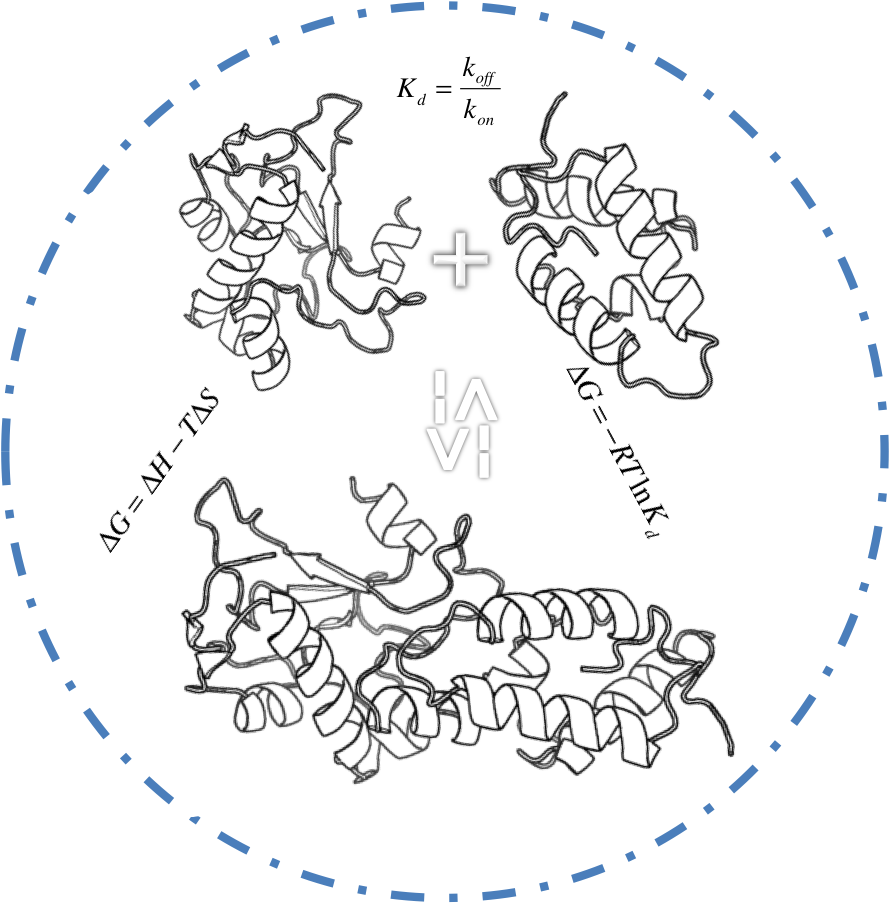
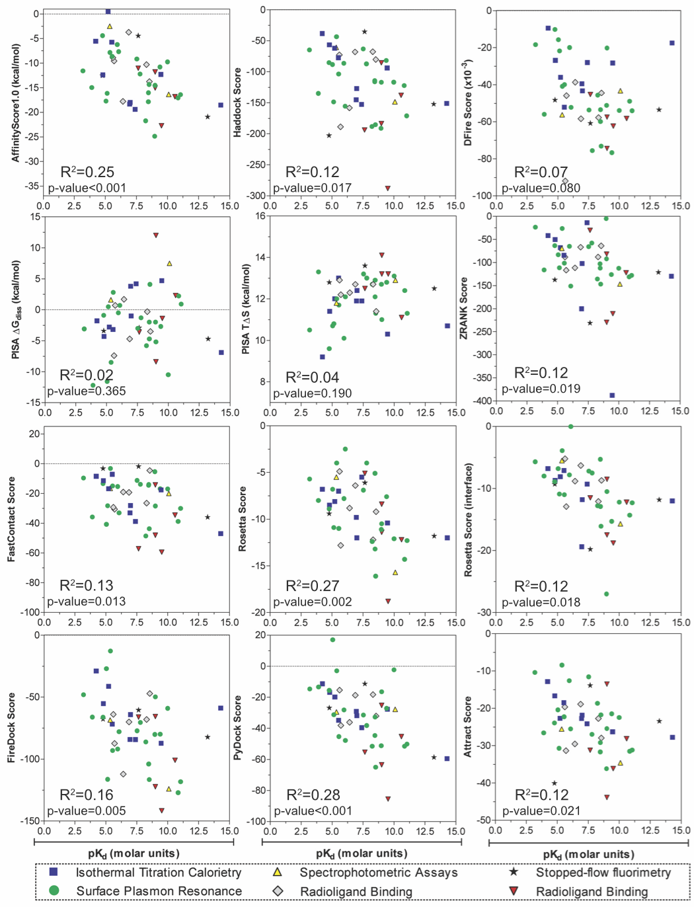

## Protein-protein binding affinity benchmark

The design of an ideal scoring function for protein−protein docking that would also predict the binding affinity of a complex is one of the challenges in structural proteomics. Such a scoring function would open the route to in silico, large-scale annotation and prediction of complete interactomes.

Here we present a protein−protein binding affinity benchmark consisting of binding constants (Kd’s) for 81 complexes. This benchmark was used to assess the performance of nine commonly used scoring algorithms along with a free-energy prediction algorithm in their ability to predicting binding affinities. Our results reveal a poor correlation between binding affinity and scores for all algorithms tested. However, the diversity and validity of the benchmark is highlighted when binding affinity data are categorized according to the methodology by which they were determined. By further classifying the complexes into low, medium and high affinity groups, significant correlations emerge, some of which are retained after dividing the data into more classes, showing the robustness of these correlations.

Despite this, accurate prediction of binding affinity remains outside our reach due to the large associated standard deviations of the average score within each group. Therefore, improvements of existing scoring functions or design of new consensus tools will be required for accurate prediction of the binding affinity of a given protein−protein complex.

In a collaborative effort with the groups of Prof. Janin (Université Paris-Sud), Dr. P. Bates (Cancer Research UK, London) and Prof. Z. Weng (University of Massachusetts Medical School, Worcester) to extend this benchmark, we have discovered a number of discrepancies corresponding to some of the reported values and entries in our previously published benchmark.

Accordingly, only 46 of the 81 reported binding affinity data can be considered fully accurate. We have reanalyzed the accuracy of the various scoring functions on this subset and, although correlations are slightly improved (sqrt(R)<0.3), current functions still do not hold any predictive capacity.

The list of 41 complexes can be found in the [Corrected_Benchmark1.0.pdf](Corrected_Benchmark1.0.pdf) file.

We have developed the protein-protein binding affinity benchmark to be of general use to the docking community for the development of the scoring functions. We welcome all suggestions aimed at improving or expanding the benchmark.

* * *

### Version history

* 23-03-2010 | The initial version of protein-protein affinity benchmark and the correlations of scoring functions to affinities.

* 03-11-2010 | Benchmark version 1.0: Major updates. A community-wide effort is on the loose, reviewing, extending and annotating the benchmark: 46/81 complexes are considered fully accurate for benchmarking studies (either their affinity data or their 3D structures). PDB IDs of the 46 complexes along with their binding affinities - **This is the current version**

* 05-11-2010 | Reanalyzing the accuracy of scoring functions in binding affinity prediction: We have re-evaluated if scoring functions can predict the affinities of protein-protein complexes, considering 46 high-quality complexes present in our updated benchmark. Although improvement of the correlations are evident, scoring is still limited in predicting binding affinities. The New_correlation figure provided in this repo illustrates those correlations.

* * * 

### Reference

When using the protein-protein binding affinity benchmark or discussing binding prediction of protein-protein complexes, please cite using the following reference:

* P. Kastritis and **A.M.J.J. Bonvin**
[Are scoring functions in protein-protein docking ready to predict interactomes? Clues from a novel binding affinity benchmark.](https://doi.org/doi:10.1021/pr9009854)
_J. Proteome Research_, *9*, 2216-2225 (2010).  See also the <a href="https://doi.org/doi:10.1021/pr101118t">published correction</a>

* * * 

### Related publications

* T Vreven+, I.H. Moal+, A. Vangone+, B.G. Pierce, P.L. Kastritis, M. Torchala, R. Chaleil, B. Jiménez-García, P.A. Bates#, Juan Fernandez-Recio#, **A.M.J.J. Bonvin**# and Z. Weng#.
[Updates to the integrated protein-protein interaction benchmarks: Docking benchmark version 5 and affinity benchmark version 2](https://doi.org/doi:10.1016/j.jmb.2015.07.016).
_J. Mol. Biol._ *19*, 3031-3041 (2015).

* A Vangone and **A.M.J.J. Bonvin**.
[Contacts-based prediction of binding affinity in protein-protein complexes](http://elifesciences.org/content/4/e07454).
_eLife_, *4*, e07454 (2015).

* P.L. Kastritis, J.P.G.L.M Rodrigues, G.E. Folkers, R. Boelens and **A.M.J.J. Bonvin**.
[Proteins feel more than they see: Fine-tuning of binding affinity by properties of the non-interacting surface.](https://doi.org/10.1016/j.jmb.2014.04.017) 
_J. Mol. Biol._ *426*, 2632-2652 (2014).

* P.L. Kastritis, J.P.G.L.M. Rodrigues and **A.M.J.J. Bonvin**
[HADDOCK2P2I: A robust biophysical model for predicting the binding affinity of protein-protein interaction inhibitors](http://pubs.acs.org/doi/abs/10.1021/ci4005332)
_J. Chem. Info. Model._ *54*, 826-836 (2014).

* P.L. Kastritis and **A.M.J.J. Bonvin**
[Molecular origins of binding affinity: Seeking the Archimedean point.](https://doi.org/doi:10.1016/j.sbi.2013.07.001)
_Curr. Opin. Struct. Biol._, *23*, 868-877 (2013).

* P.L. Kastritis and **A.M.J.J. Bonvin**
[On the binding affinity of macromolecular interactions: daring to ask why proteins interact](https://doi.org/doi:10.1098/rsif.2012.0835)
_J. R. Soc. Interface_, *10*, doi: 10.1098/rsif.2012.0835 (2013).

* P.L. Kastritis, I.H. Moal, H. Hwang, Z. Weng, P.A. Bates, **A.M.J.J. Bonvin** and J. Janin
[A structure-based benchmark for protein-protein binding affinity.](https://doi.org/doi:10.1002/pro.580)
_Prot. Sci._, *20*, 482-41 (2011).

